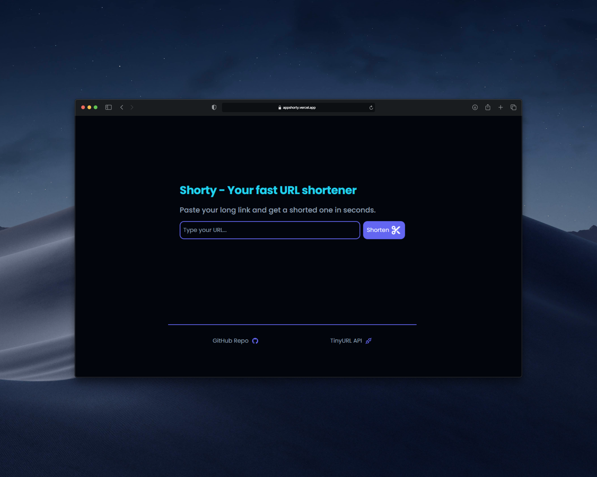

# 🔗 Shorty - URL Shortener

A fast and elegant URL shortening web application built with Vue 3, TypeScript, and Vite. Powered by the TinyURL API.



## 🌐 Live Demo

Visit the live application here: **[appshorty.vercel.app](https://appshorty.vercel.app)**

## ✨ Features

- **Instant URL Shortening**: Convert long URLs into short, shareable links in seconds
- **One-Click Copying**: Easy copy-to-clipboard functionality with visual feedback
- **Real-time Loading States**: Loading animations while shortening URLs
- **Error Handling**: Clear error messages for invalid URLs or API failures
- **Responsive Design**: Works seamlessly on desktop and mobile devices
- **Modern UI**: Clean, intuitive interface with smooth animations
- **Type-Safe**: Built with TypeScript for robust development

## 🛠️ Tech Stack

- **Frontend Framework**: Vue 3 (Composition API)
- **Language**: TypeScript
- **Build Tool**: Vite
- **URL Shortening**: TinyURL API
- **Styling**: CSS with CSS Variables
- **Node Version**: ^20.19.0 || >=22.12.0

## 📦 Project Structure

```
shorty/
├── src/
│   ├── components/
│   │   ├── Hero.vue           # Main input form and shortening logic
│   │   ├── UrlResult.vue      # Display and copy shortened URL
│   │   └── ShortyFooter.vue   # Footer component
│   ├── services/
│   │   └── shortener.ts       # TinyURL API integration
│   ├── util/
│   │   └── helpers.ts         # URL validation utilities
│   ├── App.vue                # Root component
│   ├── main.ts                # Application entry point
│   └── styles/
│       └── main.css           # Global styles and CSS variables
├── public/
│   ├── favicon.svg
│   └── mockup.png             # UI mockup screenshot
├── vite.config.ts             # Vite configuration
├── tsconfig.json              # TypeScript configuration
└── package.json               # Project dependencies

```

## 🚀 Getting Started

### Prerequisites

- Node.js (version ^20.19.0 or >=22.12.0)
- npm or yarn

### Installation

```sh
npm install
```

### Development

Start the development server with hot module replacement:

```sh
npm run dev
```

The application will be available at `http://localhost:5173`

### Build

Create an optimized production build:

```sh
npm run build
```

### Type Checking

Run TypeScript type checking:

```sh
npm run type-check
```

### Format Code

Format code using Prettier:

```sh
npm run format
```

### Preview Production Build

Preview the production build locally:

```sh
npm run preview
```

## 🔑 Environment Variables

Create a `.env.local` file in the root directory with the following variables:

```env
VITE_TINYURL_TOKEN=your_tinyurl_api_token_here
```

Get your TinyURL API token from [TinyURL Developer](https://tinyurl.com/app/dev)

## 📝 How It Works

1. **Enter URL**: Users paste their long URL into the input field
2. **Shorten**: Click the "Shorten" button to convert the URL
3. **Copy**: The shortened URL appears with a copy button for easy sharing
4. **Done**: Share the short URL anywhere!

### Behind the Scenes

- The application validates the input URL using helper functions
- Sends the URL to the TinyURL API via a secure authentication token
- Returns a shortened `tinyurl.com` link
- Displays the result with load states and error handling

## 🎨 Component Overview

### Hero Component

The main interface containing:

- Input field for URL entry
- Submit button with animated loading state
- Form submission and error handling

### UrlResult Component

Displays the shortened URL with:

- Live link to the shortened URL
- Copy-to-clipboard functionality
- Visual feedback when URL is copied

### ShortyFooter Component

Footer section for additional information or links

## 🔒 API Integration

This project uses the [TinyURL API](https://tinyurl.com/app/dev) to shorten URLs. The service:

- Makes authenticated POST requests to `https://api.tinyurl.com/create`
- Uses Bearer token authentication
- Returns shortened URLs with the `tinyurl.com` domain

## 📄 License

This project is open source and available under the MIT License.

## 👨‍💻 Author

Created by **Oriol Plazas León** - April 2026
